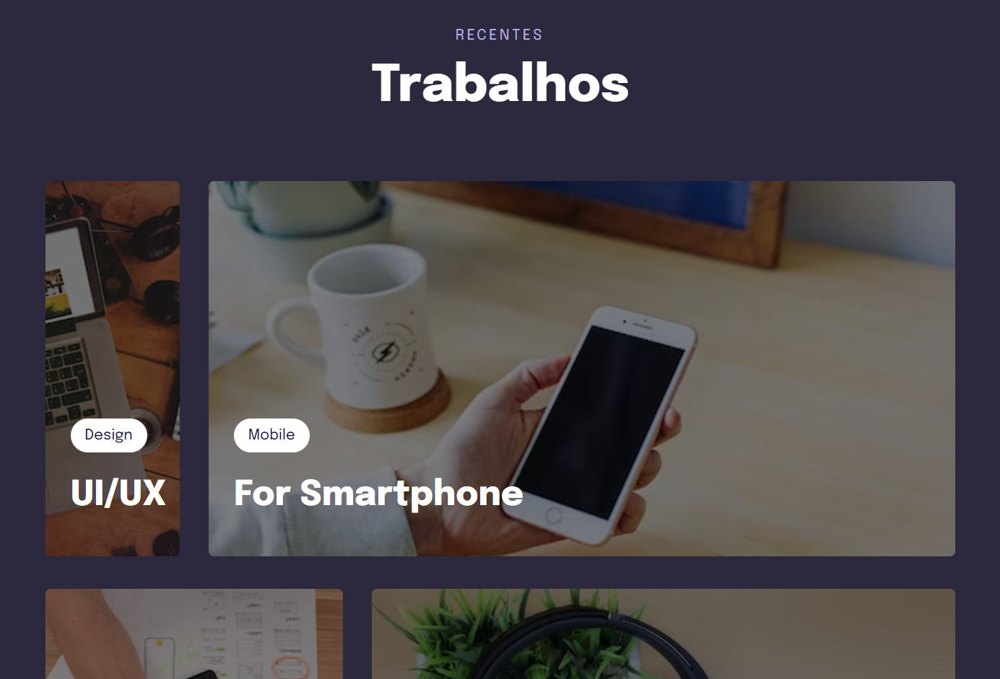

# Stage 3 - Projeto 3

>Curso Explorer

Projeto construído no curso Explorer da Rocketseat.

[ 🔗 Clique aqui para acessar](https://ricardojcosta.github.io/explorer_stage3_projeto3/)

## ⚒ Tecnologias

  - HTML (html semântico)
  - CSS (responsividade, efeitos)
  - Git e Github

## ✉ Contato

ricardoredes2006@gmail.com
  